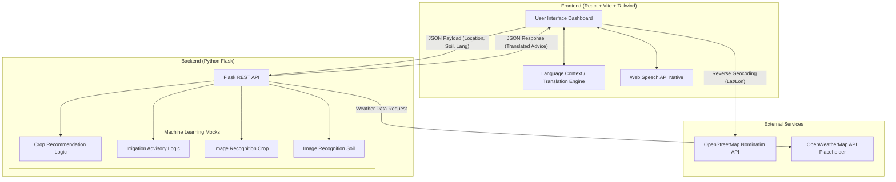
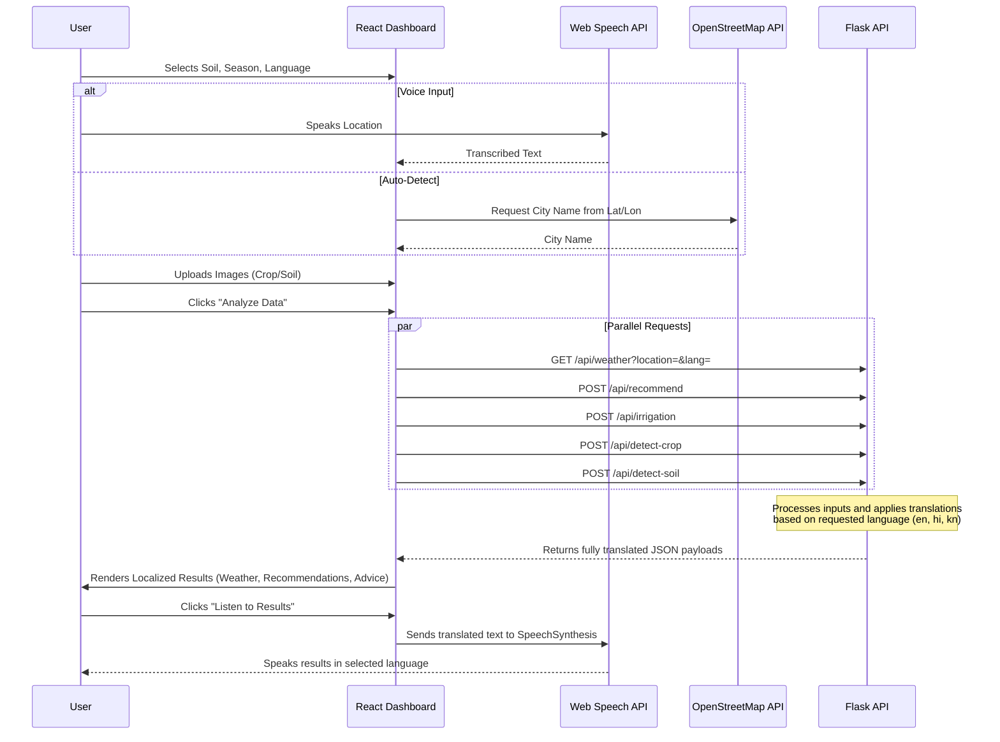

# AgroVision AI - Architecture Documentation

## System Architecture Diagram
The system follows a modern decoupled full-stack architecture, utilizing React for a dynamic frontend and Python Flask for an ML-ready backend, integrated with external APIs for location mapping and weather data.

---

## Data Flow Diagram
This diagram outlines how data travels through the system during a single "Analysis" cycle.

