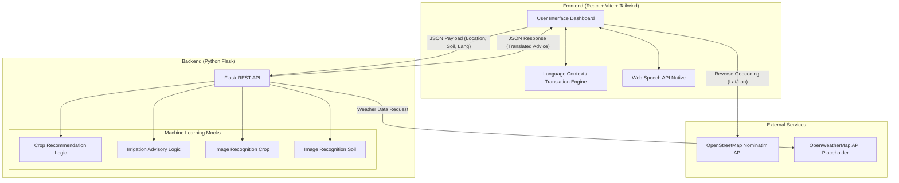
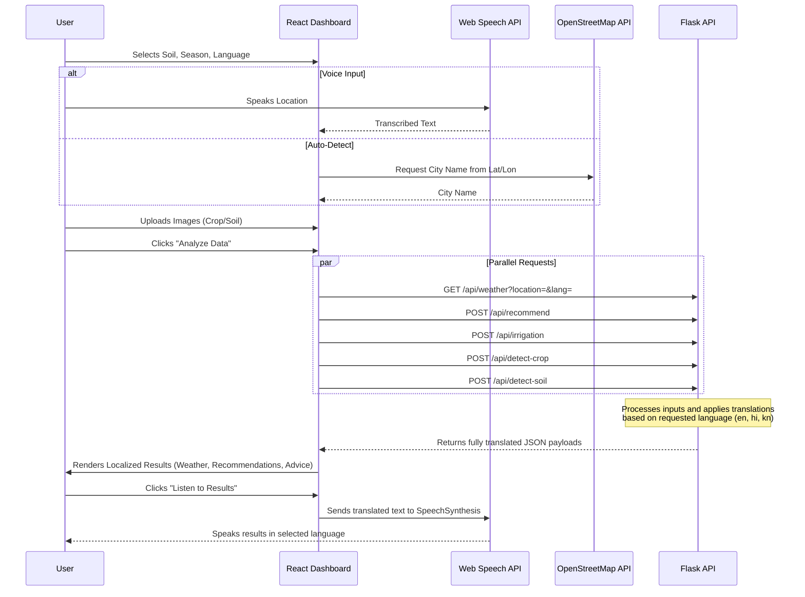

# 🌾 AgroVision AI — Smart Farming Starts Here

> Helping farmers grow the right crops, at the right time, with the right amount of water.

---

## 🌱 What Problem Does This Solve?

Farming in India is hard. Every season, farmers face the same difficult questions:

- **"Which crop should I grow this season?"** — Choosing the wrong crop for the soil or weather leads to poor yield and financial loss.
- **"How much water does my field need today?"** — Over-watering wastes precious water. Under-watering damages crops. Both hurt the farmer.
- **"Where do I get reliable advice?"** — Most farmers don't have easy access to agricultural experts, especially in rural areas.

These problems are made worse by unpredictable weather, varying soil conditions, and the lack of affordable, easy-to-use tools built specifically for farmers.

**AgroVision AI solves all of this — for free, from any phone or computer.**

---

## 💡 What Is AgroVision AI?

**AgroVision AI** is a smart farming web application that gives farmers personalized crop and irrigation advice based on their local conditions — instantly, in their own language.

A farmer simply provides:
- Their **location** (or it detects automatically)
- Their **soil type** (Sandy, Clay, Loamy, Red, or Black)
- The current **season** (Kharif, Rabi, or Summer)
- Optionally, a **photo** of their crop or soil

And within seconds, the app tells them:
- ✅ **Which 2–3 crops are best** to grow right now
- 💧 **Whether to water today** — or not
- 🌤️ **Current weather** at their location
- 🗣️ Results in ** English,Hindi, Kannada**
- 🔊 Option to **listen** to the advice aloud (for low-literacy users)

---

## 🔍 How Does It Work?

Here's the simple step-by-step flow:

```
1. Farmer opens the app on their phone or computer
        ↓
2. Enters location, soil type, and season
   (or speaks it using the voice button 🎙️)
        ↓
3. Optionally uploads a photo of their crop or soil
        ↓
4. App fetches live weather data for their location 🌤️
        ↓
5. AI analyses all inputs together
        ↓
6. App shows:
   → Best crops to grow
   → Whether to irrigate today
   → Reasoning behind each suggestion
        ↓
7. Farmer can listen to the results in their language 🔊
```

No agriculture degree needed. No expert required. Just open and ask.

---

## 🛠️ Tech Stack (In Simple Words)

You don't need to be a developer to understand this — here's what powers AgroVision AI:

| What It Does | Tool Used | Simple Explanation |
|---|---|---|
| The website / app interface | **React** | Builds the screens and buttons the farmer sees and clicks |
| Makes it look good on any screen | **Tailwind CSS** | Automatically adjusts the layout for mobile, tablet, or desktop |
| The brain / backend server | **Python Flask** | Processes all the inputs and sends back the right answers |
| Crop & irrigation recommendations | **Scikit-learn** | A trained computer program that has studied thousands of farming records to suggest the best crop |
| Detecting crop/soil from photos | **TensorFlow / Keras** | An AI model that looks at the uploaded image and identifies what crop or soil type it sees |
| Live weather data | **OpenWeatherMap API** | Fetches real-time temperature, humidity, and rainfall for any location in India |
| Voice input | **Web Speech API** | Built into the browser — lets farmers speak instead of type |
| Read results aloud | **Web Speech API** | Reads out the recommendations in the farmer's language |

**In short:** The farmer talks to the app → the app thinks using AI → the app talks back with advice.

---

## 🌍 Who Is This For?

- 🧑‍🌾 **Small and marginal farmers** across India who lack access to agricultural advisors
- 👨‍👩‍👧 **Rural families** who depend on farming as their primary income
- 🏛️ **Government programs and NGOs** looking for digital tools to support farmers
- 🎓 **Agricultural students and researchers** who want to explore AI in farming

---

## 🗣️ Language Support

AgroVision AI speaks your language. Results can be viewed and heard in:

- 🇮🇳 Hindi
- 🌿 Kannada
- 🌐 English (default)

---

## 📱 Works On Any Device

- Mobile phones ✅
- Tablets ✅
- Laptops and desktops ✅
- No app download needed — just open in a browser ✅

---

## 🚀 Impact We Hope To Create

> *"If a farmer knows what to grow and when to water, half the battle is already won."*

- Reduce **crop failure** caused by wrong crop selection
- Save **water** through smarter irrigation decisions
- Bring **AI-powered farming advice** to every farmer, not just those with resources
- Support **food security** by helping farmers maximize yield

---

## 📬 Contact & Contributions

Have feedback or want to contribute? Open an issue or reach out — this project is built for the farming community and every improvement helps a real farmer.

---

> Built with ❤️ for the farmers of India.
# AgroVision AI - Architecture Documentation

## System Architecture Diagram
The system follows a modern decoupled full-stack architecture, utilizing React for a dynamic frontend and Python Flask for an ML-ready backend, integrated with external APIs for location mapping and weather data.



---

## Data Flow Diagram
This diagram outlines how data travels through the system during a single "Analysis" cycle.


